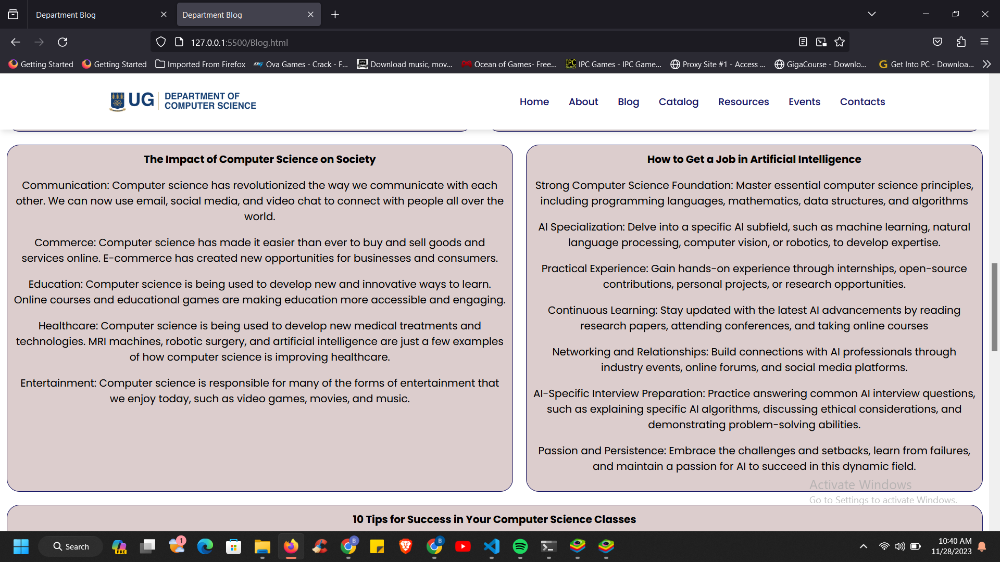

# Project Name
DCS Website Replica

Brief Introduction:
-------------------
Welcome to an improved version of the Universiy of Ghana's Department of Computer Science website. As an interim assessment, we are tasked to code an improved replica of the website of the department of computer science of university of Ghana with new functionalities, features and design. We are to add new functionalities to the site as well and style to make it more appealing. It is an educational site.

## Table of Contents
1. [Introduction](#brief-introduction)
2. [Setup Instructions](#setup-instructions)
3. [Author](#author)
4. [Page Links](#Buttons-to-new-pages)
5. [Screenshots](#screenshots)
6. [Lessons Learnt](#what-i-have-learned)

## Setup Instructions
---------------------
### Cloning the Project
1. Clone the repository to your local machine:
    git clone https://github.com/kev-69/DCIT_205_IA.git

2. Change into the project directory:
    cd DCIT_205_IA

### Setting Up the Project

1. Forked the repo from the required link (https://github.com/Daquiver1/DCIT_205_IA)

2. Created folders for icons and images to be used on the site

3. Started with the home pages. Created a header for nav bar and a footer and copied and pasted it across all the pages

4. Initialized the repo and started to stage and commit little changes

5. Saved the common repo and kept a copy on my local pc

6. Submitted a pull request (PR) to the admin

## Author
---------
Name: [Bismark Obuobi]
Student ID: [11146250 ]

## Buttons-to-new-pages
1. "Home" (On the nav bar)
2. "About" (On the nav bar)
3. "Blog" (On the nav bar)
4. "Catalog" (On the nav bar)
5. "Resources" (On the nav bar)
6. "Events" (On the nav bar)
7. "Contacts" (On the nav bar)
8. "Sign Up for Freemium" (On the Home page)
9. "Sign Up for Premium" (On the Home page)
10. "View All Profiles" (On the Home page)

## Screenshots
--------------
Screenshots from the various pages

### Home Page

*Visitors can use the buttons here to enroll for a free or paid course*

*Some departments heads with their social media profiles*

### Freemiun Page

*A page for visitors and students to enroll for free course with a javascript provided so that they can only select a maximum of 4 courses*

### About Page

### Blog Page

### Catalog Page

*A section showing courses offered by CS and IT students*

*A section showing the criteria for admitting CS students*

### Resources Page

### Events Page

*A section showing ongoing events*

*A section showing upcoming events and visitors can enroll*

### Enroll Page

*A form for students and visitors to enroll to participate in upcoming events*

### Contacts Page

*A map pointing exactly to the location of the department(requires internet connection)*

*Department contact details and a textbox to send a message to inquire about the department*

### Profile Page

*Don't know their names so I couldn't include that*

### Footer Section

## What I Have Learned
----------------------
1. In the beginning of the project, I have made all my files in a different folder before I forked and cloned the repo. Since I didnt want to lose all my commit I learnt a way to merge the files to the forked repo without losing my previous commits.
2. Learnt how to
3. 
4. 
5. 
6. 
7. 